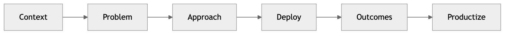

# Field-Deployed Engineer Showcase



[](https://github.com/cmangun/field-deployed-engineer-showcase/actions/workflows/ci.yml)
[]()
[]()

Case studies and artifacts from forward-deployed AI engineering engagements.

---

## 🚀 Browse in 60 Seconds

```bash
git clone https://github.com/cmangun/field-deployed-engineer-showcase.git
cd field-deployed-engineer-showcase
cat case-studies/pfizer-cocreate.md
```

**Or view online:** [github.com/cmangun/field-deployed-engineer-showcase](https://github.com/cmangun/field-deployed-engineer-showcase)

---

## 📊 Customer Value

These case studies demonstrate:
- **35% faster** compliance reviews (ML automation)
- **98% reduction** in knowledge discovery time (RAG)
- **Zero FDA audit findings** (pipeline migration)

---

## Case Studies

| Client | Project | Outcome |
|--------|---------|---------|
| **Pfizer** | RAG Knowledge Platform | 98% faster discovery, 35% faster compliance |
| **Abbott** | ML Pipeline Migration | Zero FDA findings, 6mo → 3wk deployment |
| **IPG Health** | Platform Consolidation | $51M portfolio, 99.9% uptime |

---

## Case Study Format

Each case study follows the FDE narrative structure:

```
┌─────────────────────────────────────────────────────────────┐
│  1. CONTEXT                                                  │
│     Industry, constraints, stakeholders                      │
├─────────────────────────────────────────────────────────────┤
│  2. PROBLEM                                                  │
│     What was failing, slow, risky, or non-compliant         │
├─────────────────────────────────────────────────────────────┤
│  3. APPROACH                                                 │
│     Discovery → Design → Build → Deploy → Stabilize         │
├─────────────────────────────────────────────────────────────┤
│  4. DEPLOYMENT & STABILIZATION                               │
│     Runbooks, monitoring, incident handling                 │
├─────────────────────────────────────────────────────────────┤
│  5. OUTCOMES                                                 │
│     Latency, throughput, adoption, business impact          │
├─────────────────────────────────────────────────────────────┤
│  6. WHAT I WOULD PRODUCTIZE                                  │
│     Patterns extracted for reuse                            │
└─────────────────────────────────────────────────────────────┘
```

---

## Artifacts

| Artifact | Purpose |
|----------|---------|
| `runbook-example.md` | Operational runbook template |
| `postmortem-example.md` | Incident postmortem format |
| `adr-example.md` | Architecture decision record |

---

## Related Repositories

| Repo | Demonstrates |
|------|--------------|
| [deployable-ai-agents](https://github.com/cmangun/deployable-ai-agents) | Agent patterns from engagements |
| [enterprise-llm-integration](https://github.com/cmangun/enterprise-llm-integration) | LLM governance from Pfizer work |
| [regulated-data-pipelines](https://github.com/cmangun/regulated-data-pipelines) | ETL patterns from Abbott work |

---

## Next Iterations

- [ ] Add Medtronic case study
- [ ] Add Amgen case study
- [ ] Add architecture diagrams (Mermaid)
- [ ] Add engagement timeline visuals
- [ ] Add lessons learned section

---

## License

MIT © Christopher Mangun

**Portfolio**: [field-deployed-engineer.vercel.app](https://field-deployed-engineer.vercel.app/)
